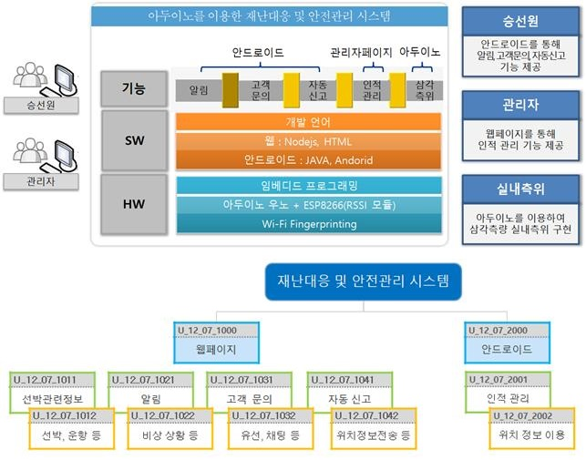

# Hanium-Project
### Disaster Response and Safety Management System Using Aduino
In the event of an emergency situation such as a ship accident, we felt the need to establish a system for identifying the location of crew members to ensure safety management. In the event of an accident, we thought we needed a space to ask the first person about questions related to the ship by automatically reporting the ship and informing the crew of the instructions for action.

# Functions
[SW]
1) Notification function
2) Function of customer inquiry
3) Automatic reporting function
4) Human management function
5) Implementation of KNN

[HW]
1) Propagation of RSSI value

### Screenshot

